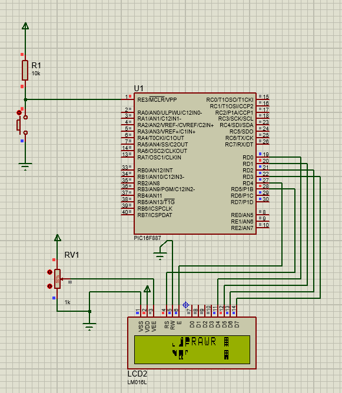
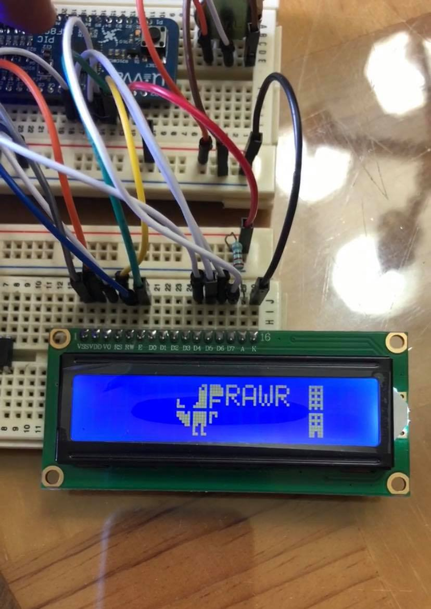

# LCD-DynamicDinosaur
Here you'll find the code in Assembly programming language that displays a dinosaur going towards a building in an LCD display, the code was implemented in a PIC16F887 microcontroller. In addition, here is the file of the simulation made in the software Proteus Design.

## Simulation running in Proteus Design software

